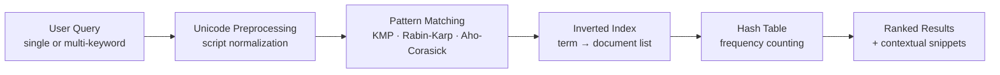

<div align="center">

# Unicode Pattern Search Engine
### for Indian-Language Wikipedia

*A Data Structures &amp; Algorithms&#8209;3 capstone — Team 12, Section 7 — Course 25CS2103E*


</div>

---

## Abstract

Indian-language Wikipedia is growing faster than the tools built to search it. This project is a text-retrieval engine that searches and identifies patterns across multilingual content using the Unicode standard — supporting English, Hindi, Telugu, Tamil, and Bengali rather than just ASCII.

It combines three pattern-matching algorithms (**KMP**, **Rabin-Karp**, **Aho-Corasick**) with an **inverted index** and **hash tables** for fast lookup, supports single and multi-keyword queries, ranks results by relevance, and returns contextual snippets so a result is useful the moment it appears.

## Table of contents

- [Problem statement](#problem-statement)
- [How a query moves through the system](#how-a-query-moves-through-the-system)
- [The matching engine](#the-matching-engine)
- [Where it started — the foundations](#where-it-started--the-foundations)
- [The corpus](#the-corpus)
- [Repository map](#repository-map)
- [Running it locally](#running-it-locally)
- [Team](#team)
- [Roadmap](#roadmap)

## Problem statement

| Challenge | Why it matters |
|---|---|
| **Rapid content growth** | Indian-language Wikipedia articles are expanding quickly, and search needs to scale with them. |
| **Unicode complexity** | Devanagari, Telugu, Tamil, and Bengali each require proper normalization before pattern matching can even begin. |
| **Missing capabilities** | Most existing tools lack efficient indexing and real multi-keyword search for Indian languages. |

**Core challenge:** build a fast, scalable, Unicode-aware search engine using efficient DSA techniques.

## How a query moves through the system



## The matching engine

| Component | Role | Complexity | Idea |
|---|---|---|---|
| **KMP** | single-pattern search | `O(n + m)` | A precomputed failure function means the scan never re-reads a matched character. |
| **Rabin-Karp** | hash-based, multi-pattern | `O(n + m)` avg | A rolling hash slides the comparison window in constant time per step. |
| **Aho-Corasick** | multi-keyword, one pass | `O(n + m + z)` | A trie of every keyword, joined by failure links, finds every match in a single sweep. |
| **Inverted Index** | retrieval structure | sub-linear | Maps each keyword directly to the documents containing it. |
| **Hash Table** | frequency counting | `O(1)` avg | Backs the relevance-ranking counts across the whole corpus. |

For scale: a naive character-by-character scan (see `TextHackCorpus` below) costs `O(n·m)` — this is exactly the cost KMP, Rabin-Karp, and Aho-Corasick are built to avoid.

## Where it started — the foundations

Seven small Java exercises built up the ideas the engine now runs on, before the capstone brought them together:

| # | File | What it does | Core idea |
|---|---|---|---|
| 01 | `VowelCounter` | Counts vowels in a line of input | linear scan · `O(n)` |
| 02 | `WordCounter` | Splits on whitespace and counts tokens | tokenization |
| 03 | `SentenceCounter` | Splits on `[.!?]+`, counts non-empty sentences | regex split |
| 04 | `palindromecheck` | Strips punctuation, lowercases, reverses, compares | two-pointer logic |
| 05 | `WordFrequency` | Builds a full word → count map | hashing |
| 06 | `MostFrequentWord` | Same map plus a running max, returns the top word | hashing + max-track |
| 07 | `TextHackCorpus` | Loads titled `.txt` articles into an `Article` model, then runs naive keyword search across the loaded corpus from an interactive menu | OOP · `O(n·m)` naive scan |

<details>
<summary><strong>Sample run — <code>MostFrequentWord</code></strong></summary>

```
Most frequent word: fun
Frequency: 3
```

</details>

<details>
<summary><strong>Sample run — <code>TextHackCorpus</code></strong></summary>

```
========== TEXT HACK MENU ==========
1. Display Corpus
2. Keyword Analytics
3. Exit
Enter your choice: 2
Enter keyword: telangana

Keyword Analysis for: telangana
Article 1 (Telangana) : 3 occurrences
```

</details>

## The corpus

**500 documents** — 100 short Wikipedia-style articles in each of five languages, used to exercise every algorithm above.

```
corpus/
├── english/   100 docs   Aa
├── hindi/     100 docs   हि
├── telugu/    100 docs   తె
├── tamil/     100 docs   த
└── bengali/   100 docs   বা
```

## Repository map

```
DSA--3/
├── corpus/                # 500 documents, 5 languages × 100
│   ├── english/  hindi/  telugu/  tamil/  bengali/
│   └── document1.txt … document100.txt   (per language)
├── project/                # the capstone write-up
│   ├── DSA Abstract.pdf
│   └── Unicode-Pattern-Search-Engine-for-Indian-Language-Wikipedia.pdf
├── VowelCounter             — 01 · foundations
├── WordCounter               — 02 · foundations
├── SentenceCounter           — 03 · foundations
├── palindromecheck           — 04 · foundations
├── WordFrequency              — 05 · foundations
├── MostFrequentWord           — 06 · foundations
├── TextHackCorpus              — 07 · naive search + corpus model
└── README.md
```

## Running it locally

Each foundation file is a single-class Java program — compile and run directly:

```bash
javac VowelCounter && java VowelCounter
javac WordFrequency && java WordFrequency
javac TextHackCorpus && java TextHackCorpus   # expects a folder named `articles/` of .txt files
```

## Team

| | |
|---|---|
| **Guide** | Dr S Madhavi — Associate Professor, CSE |
| **Team** | Badugu Jhahnavi (2520030452) · P Mouvya Sri (2520030449) · K Yagnesh (2520030121) |
| **Team / Section** | Team 12 · Section 7 |
| **Course** | Data Structures &amp; Algorithms-3 (25CS2103E) · A.Y. 2026-2027 |
| **Institution** | Hyderabad, Telangana, India |

## Roadmap

- [ ] Relevance ranking with **TF-IDF** and **BM25**
- [ ] A **web interface** reachable from any device
- [ ] **Distributed processing** to scale past 500 documents

---

<div align="center">

*A companion showcase page (interactive architecture diagram + live naive-search demo) is available as a published artifact.*

</div>
